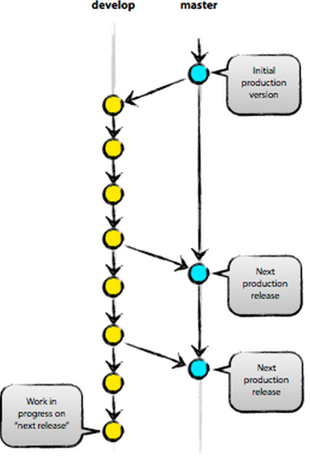

Git必懂指令
===========

瞭解使用Git時所必備的指令，可以從單人開發及多人合作開發的情境著手。

單人開發的情境可以了解如何利用Git從無到有建立具版本控制的開發流程；多人合作開發的情境能夠了解如何透過Git在不影響開發環境之下與其他團隊成員共同協作。

在開始之前，有一點觀念必須釐清。版本的演進，是線性的演進，因此我們通常會有一個稱為 ``master`` 的主線。而開發過程所發現的issue或是需要新增的功能，我們會希望在不影響 ``master`` 的情況下，複製 ``master`` 衍生出一個分支(branch)進行開發，等到分支開發完成、測試穩定之後，才會與 ``master`` 主線合併(merge)，演化出全新的版本，如下圖所示。

    線性的演化 [Ref1]_

.. [Ref1] A successful Git branching model, http://nvie.com/posts/a-successful-git-branching-model/

===========================
單人開發模式 - 新增篇
===========================

本章節將會介紹在單人開發模式之下所需要的幾個重要指令。

首先，建立一個專案資料夾 ``gittest``，我們將對這個專案資料夾裡面的所有檔案進行版本控制。 ::

	$ mkdir gittest

接著，我們必須指定Git對這個專案資料夾進行版本控制，指令形式為 ``git init [資料夾名稱]`` 。 ::

	$ git init gittest

上述指令成功之後，系統會顯示類似以下的訊息，可以看到Git會在專案資料夾內建立一個 ``.git`` 的隱藏資料夾。事實上，Git就是將所有的版本控制相關的資訊儲存於此一隱藏資料夾內，因此這個資料夾不應被刪除。 ::

	Initialized empty Git repository in /home/vans/gittest/.git/

再來，我們試圖模擬一般的程式開發過程，在這個資料夾內新增兩個檔案 ``README`` 與 ``HelloWorld.c`` 。 ::

	$ touch README HelloWorld.c

新增檔案之後，我們仍需要知道這些檔案的在版本控制系統內的狀態 *(untracked, unmodified, modified, staged)* ，以確定哪些檔案被新增、變更、刪除等，便於進行後續的管理，例如告知Git需要將新增的檔案納入版本控制、接受變更等。察看檔案狀態的指令為 ``git status`` 。 ::

	$ git status
	# On branch master
	#
	# Initial commit
	#
	# Untracked files:
	#   (use "git add <file>..." to include in what will be committed)
	#
	#	HelloWorld.c
	#	README
	nothing added to commit but untracked files present (use "git add" to track)

上述的指令顯示了幾項資訊，分述如下：

#. On branch master, 位於名為 ``master`` 的分支
#. Initial commit, 目前尚未有第一次的 ``commit`` (提交變更)
#. Untracked files, 顯示 ``HelloWorld.c`` , ``README`` 尚未被Git列入追蹤項目，可以使用 ``git add <file> ...`` 或 ``git add .`` 將這些檔案列入追蹤，以列入後續提交變更 *(commit)* 的項目

由於這些檔案尚未被列入追蹤項目，因此可以使用 ``git add <file> ...`` 將這些項目列入追蹤。 ::

	$ git add *.c
	$ git add README

若使用 ``git add .`` 則是直接將所有未加入追蹤的檔案一併列入追蹤。

將檔案列入追蹤之後，可以再使用 ``git status`` 察看目前的檔案狀態，可以觀察到檔案狀態已經變更了。 ::

	$ git status
	# On branch master
	#
	# Initial commit
	#
	# Changes to be committed:
	#   (use "git rm --cached <file>..." to unstage)
	#
	#	new file:   HelloWorld.c
	#	new file:   README
	#

上方的 ``git status`` 結果，可以看到 *Changes to be committed* 指明了 ``HelloWorld.c`` 與 ``README`` 已經列入追蹤並且在等待提交變更之列。如果你後悔不想將這個項目列入追蹤，可以使用 ``git rm --cached <file> ...`` 將指定的檔案移除追蹤項目。

最後，當你覺得這些檔案已經沒有變更需要，或是程式bug已經被修正之後，就可以使用 ``git commit`` 提交變更。 例如： ::

	$ git commit -m "The first commit of gittest project"
	[master (root-commit) 2ef8adc] The first commit of gittest project
	 0 files changed
	 create mode 100644 HelloWorld.c
	 create mode 100644 README

同樣地，上述的指令結果在以下分點說明：

#. ``git commit -m <此次提交的簡短說明>`` , 若不使用 ``-m`` 參數，則會以系統偏好使用的編輯器請使用者輸入此次提交的簡短說明，如以下訊息(第1行是讓使用者輸入說明的地方)： ::
	
	1 #                                                                             
	2 # Please enter the commit message for your changes. Lines starting
	3 # with '#' will be ignored, and an empty message aborts the commit.
	4 # On branch master
	5 # Changes to be committed:
	6 #  (use "git reset HEAD <file>..." to unstage)

#. ``[master (root-commit) 2ef8adc]`` 代表於 ``master`` 分支上提交變更，提交變更碼為 ``2ef8adc`` (簡短碼) 

每一次的提交變更，都會有一筆日誌紀錄，如果要察看這些日誌紀錄，可以使用 ``git log`` 察看。 ::

	$ git log
	commit 2ef8adccb61f46179f30ee017690519abb0b2c15
	Author: vans <vans@gmail.com>
	Date:   Mon Jul 15 16:56:57 2013 +0800

	    The first commit of gittest project

此外，如果沒有任何提交變更紀錄，就會出現類似以下的紀錄： ::

	fatal: bad default revision 'HEAD'

*HEAD* 代表當前所在的分支(current branch)，Git以 *HEAD* 做為指標以指明當前所在的分支。

提交變更之後，可以試試再看一次 ``git status`` ，就可以發現目前已經沒有任何檔案需要再提交變更。 ::

	$ git status
	# On branch master
	nothing to commit (working directory clean)

至此，我們可以用下圖闡述Git的檔案狀態的轉換。

.. figure:: images/file_status.png
    :align: center

    Git的檔案狀態的轉換 [Ref2]_

.. [Ref2] Git Documentation, http://git-scm.com/documentation

圖上解釋了大部份的檔案狀態轉換，其中較為令人疑惑的狀態應為 *staged* 。事實上，在使用 ``git add <file> ...`` 將檔案加入追蹤項目之後，在提交變更之前，就是處於 *staged* 的狀態，而以 ``git rm --cache <file> ...`` 將檔案移出追蹤項目就會使得檔案轉換為 *unstaged* 狀態 *(not staged)* 。

===========================
單人開發模式 - 修改篇
===========================

進行首次的提交變更之後，可能會發現某些檔案又需要進行再次的修正，我們以修改 ``HelloWorld.c`` 做為練習，並以 ``git status`` 查看檔案狀態。 ::

	$ cat "#include <stdio.h>" > HelloWorld.c
	$ git status
	# On branch master
	# Changes not staged for commit:
	#   (use "git add <file>..." to update what will be committed)
	#   (use "git checkout -- <file>..." to discard changes in working directory)
	#
	#	modified:   HelloWorld.c
	#
	no changes added to commit (use "git add" and/or "git commit -a")

從上述的修改結果，可以發現 ``HelloWorld.c`` 進入了 ``modified`` 的狀態，但仍處於 ``not staged`` 的狀態。

修改檔案後，我們可以有兩種選擇：

#. ``git add <file> ...`` 將檔案加入 ``stage``
#. ``git checkout -- <file> ...`` 取消檔案變更，回到未更改前的狀態

此處，我們將檔案加入 ``stage`` ，以觀察檔案狀態變化。 ::

	$ git add HelloWorld.c 
	$ git status
	# On branch master
	# Changes to be committed:
	#   (use "git reset HEAD <file>..." to unstage)
	#
	#	modified:   HelloWorld.c
	#

上述結果可以發現， *Changes not staged for commit* 已變成 *Changes to be committed* ，代表檔案已經進入 ``staged`` 狀態。

此處可得出幾個小結論：

#. 檔案修改後還沒被 ``git add`` 時的狀態為 ``unstaged``
#. 檔案修改後被 ``git add`` 之後的狀態為 ``staged``
#. ``staged`` 的檔案被提交變更之後就會回到 ``unmodified``

同樣地，在提交變更之前，仍可使用 ``git reset HEAD <file> ...`` 將檔案從 ``staged`` 狀態回復至 ``unstaged`` 。這些提示在使用 ``git status`` 時就能夠看到。接下來試著將檔案 ``unstage`` 。 ::

	$ git reset HEAD HelloWorld.c
	Unstaged changes after reset:
	M	HelloWorld.c
	
同樣使用 ``git status`` 察看檔案狀態，可以發現檔案回到 ``unstaged`` 狀態，如下所示。 ::

	$ git status
	# On branch master
	# Changes not staged for commit:
	#   (use "git add <file>..." to update what will be committed)
	#   (use "git checkout -- <file>..." to discard changes in working directory)
	#
	#	modified:   HelloWorld.c
	#
	no changes added to commit (use "git add" and/or "git commit -a")

在 ``unstaged`` 的狀態下，還可以使用 ``git diff`` 指令，比較變動之前的版本與變動之後的差異。 ::

	$ git diff
	diff --git a/HelloWorld.c b/HelloWorld.c
	index e69de29..53c5fdf 100644
	--- a/HelloWorld.c
	+++ b/HelloWorld.c
	@@ -0,0 +1 @@
	+#include <stdio.h>

上述 ``git diff`` 的結果，左邊代表變動之前，右邊代表變動之後。

除了比較 ``unstaged`` 之檔案變動差異，也能夠指定Git比較與 ``staged`` 之差異。 ::

	$ git diff --staged

``git diff --staged`` 等於 ``git diff --cached`` 。原因在於使用 ``git add <file> ...`` 之後，Git會將變動的檔案快取起來，因此 ``staged`` 又可以稱為 ``cached`` ，也由於快取機制，因此在檔案進入 ``staged`` 狀態之後，就存在一份快取，若此時再對檔案進行變動，其變動將不會出現，因為是以快取起來的檔案為主，所以進行 ``git diff`` 就無法看到差異。解決此種問題，就需要將檔案回復為 ``unstaged`` 狀態之後再變為 ``staged`` 。

瞭解 ``staged`` 與 ``unstaged`` 之後，就可以學會 ``git commit -a`` 偷懶指令。 ::

	$ git commit -a

上述指令代表將全部 ``unstaged`` 加到 ``staged`` 後直接提交變更。

本篇最後一個修改的指令為 ``git mv <file> <new_file>`` ，可使用此一指令對檔案進行重新命名。唯一需要注意的是此重新命名的功能並 **不區分大小寫** ，因此檔名相同但大小寫不同也會視為同一檔案而無法進行重新命名。 ::

	$ git mv README README_V2
	$ git status
	# On branch master
	# Changes to be committed:
	#   (use "git reset HEAD <file>..." to unstage)
	#
	#	renamed:    README -> README_V2
	#

===========================
單人開發模式 - 刪除篇
===========================

開發過程也會遇到需要將檔案刪除的情況，若直接將檔案刪除，Git也能夠偵測到檔案已被刪除。但最好使用 ``git rm <file> ...`` 較為安全，且能夠有回復的機會。

以下指令過程為新增一檔案 ``bad.c`` 並且提交之後以 ``git rm <file> ...`` 刪除該檔案。

#. 新增檔案 ``bad.c`` ，並提交變更 ::

	$ touch bad.c; git add .; git commit -a
	$ git log --graph
	* commit 19c3e6add40213002bcd46f2a5036f66ec5a0698
	| Author: vans <vans@gmail.com>
	| Date:   Tue Jul 16 09:36:14 2013 +0800
	| 
	|     bad.c added
	|  
	* commit 2ef8adccb61f46179f30ee017690519abb0b2c15
	  Author: vans <vans@gmail.com>
	  Date:   Mon Jul 15 16:56:57 2013 +0800
	  
	      The first commit of gittest project
	$
	$ ls
	HelloWorld.c	README		bad.c

#. 刪除檔案 ``bad.c`` ，可以看到檔案 ``bad.c`` 已被刪除 ::

	$ git rm bad.c
	rm 'bad.c'
	$
	$ ls
	HelloWorld.c	README

#. 使用 ``git status`` 可以發現檔案仍在 ``unstaged`` 仍可以回復 ::
	
	$ git status
	# On branch master
	# Changes not staged for commit:
	#   (use "git add/rm <file>..." to update what will be committed)
	#   (use "git checkout -- <file>..." to discard changes in working directory)
	#
	#	deleted:    bad.c
	#
	no changes added to commit (use "git add" and/or "git commit -a")

#. 使用 ``git checkout -- <file> ...`` 救回 ``bad.c`` ::

	$ git checkout bad.c
	$ ls
	HelloWorld.c	README		bad.c
	$ git status
	# On branch master
	nothing to commit (working directory clean)

#. 再次刪除 ``bad.c`` ::

	$ git rm bad.c
	$ git commit -m "bad.c deleted"

#. 察看日誌紀錄 ::

	$ git log
	commit a842389065ee6e28179de7b512fea9e9ddc33d41
	Author: vans <vans@gmail.com>
	Date:   Tue Jul 16 09:42:02 2013 +0800

	    bad.c deleted

	commit 19c3e6add40213002bcd46f2a5036f66ec5a0698
	Author: vans <vans@gmail.com>
	Date:   Tue Jul 16 09:36:14 2013 +0800

	    bad.c added

	commit 2ef8adccb61f46179f30ee017690519abb0b2c15
	Author: vans <vans@gmail.com>
	Date:   Mon Jul 15 16:56:57 2013 +0800

	    The first commit of gittest project

#. 假設提交變更的說明寫錯，想要試圖更正的話，可以使用以下指令進行更正。 ::

	$ git commit --amend

===================================
單人開發模式 - 刪除Git日誌中的資料
===================================

開發程式、系統時，難免會有利用設定檔管理的方式，此時設定檔中不免會存放帳號密碼等隱密資訊，如果不小心將這個設定檔加到版本控制中，即使將設定檔刪除，也會存在日誌檔中。此時最好的辦法就是將日誌中的相關紀錄也一併刪除，刪除的方法可以參考以下方法( ``git filter-branch`` , ``bfg`` )： ::

	$ git filter-branch --force --index-filter 'git rm --cached --ignore-unmatch <YOUR_CONFIG>' --prune-empty --tag-name-filter cat -- --all 
	$ git push origin master --force

上述第2行指令將本地的日誌傳到遠端的儲存庫後，覆寫掉遠端儲存庫的日誌檔，確保不會有相關紀錄存在。

或者使用 ``bfg`` 指令： ::

	$ bfg --delete-file <YOUR_CONFIG>
	$ bfg --replace-text passwords.txt

詳情可以參照 `GitHub Remove sensitive data <https://help.github.com/articles/remove-sensitive-data>`_ 。

=================
多人合作開發模式
=================

多人合作開發模式中，會由Git Server提供中央的儲存庫(repository)儲存主線(master)，再由其他團隊成員複製(clone)主線到各自的開發環境中成為分支(branch)，在各自的環境內開發完成之後再將分支推送(push)回主線。如此重複循環作業。

Git目前支援SSH, HTTP兩種協定進行網路協作。以SSH協定複製Git Server上專案的指令為 ``git clone <user@remoteserver:project>`` ，例如： :: 

	$ git clone git@10.2.0.15:project.git

複製完成之後，可以使用 ``git remote -v`` 或 ``git remote show origin`` 察看完整的遠端儲存庫資訊，例如： ::

	$ git remote -v
	origin	git@10.2.0.15:~git/repositories/vans/GitRepo.git (fetch)
	origin	git@10.2.0.15:~git/repositories/vans/GitRepo.git (push)
	$	
	$ git remote show origin
	* remote origin
	  Fetch URL: git@10.2.0.15:~git/repositories/vans/GitRepo.git
	  Push  URL: git@10.2.0.15:~git/repositories/vans/GitRepo.git
	  HEAD branch: master
	  Remote branch:
	    master tracked
	  Local branch configured for 'git pull':
	    master merges with remote master
	  Local ref configured for 'git push':
	    master pushes to master (fast-forwardable)

上述的結果中的 *fetch*, *push* 分別代表 *取得版本更新的位置* 與 *推送新版本的位置* 。

若要新增遠端儲存庫，可使用 ``git remote add <shortname> <url>`` ，例如： ::
	
	$ git remote add pb git://github.com/paulboone/ticgit.git
	$ git remote -v
	origin  git://github.com/schacon/ticgit.git
	pb  git://github.com/paulboone/ticgit.git

若是需要重新命名遠端儲存庫名稱，可使用 ``git remote rename <branch> <new_branch>`` 。 ::

	$ git remote rename pb my_pb

一般複製(clone)回來的程式版本，會以 ``git checkout -b <branch>`` 另外命名新的分支名稱，以取代原本的 ``master`` ，通常會以issue編號或是新功能名稱命名。例如： ::

	$ git checkout -b "HellowWorld"

建立新的分支之後，可以使用 ``git branch`` 查看目前分支，米字號(*)的項目代表目前所在分支。 ::

	$ git branch
	* HellowWorld
	  master

如果要切換分支可以使用 ``git checkout <branch>`` 進行，例如：::

	$ git checkout master

刪除分支則是 ``git branch -d <branch>`` ，例如： ::

	$ git branch -d HellowWorld

建立完分支之後，其實後續的作業模式就如同單人開發模式，唯一不同的是會在提交變更之後需要推送回遠端儲存庫，推送的指令為 ``git push <remote_branch_shortname> [local_branch] `` ，例如： ::

	$ git push origin master

上述的指令為將本地的 ``master`` 推送回 ``origin`` 的遠端儲存庫。

有時候，推送的過程並不會毫無問題，由於是多人合作開發的情況，因此十分有可能在你推送新版本回遠端儲存庫時，其他團隊成員就已經有推送一版新的版本，導致你本地的版本並非最新的版本或是有版本衝突的問題。

在此假設成員A已經在一天前推送一版新的程式，並未通知你要進行版本更新，此時若你要進行推送新的版本，就有可能會得到類似以下的錯誤訊息。 ::

	$ git push origin master
	To git@10.2.0.15r:~git/repositories/vans/GitRepo.git
	 ! [rejected]        master -> master (non-fast-forward)
	error: failed to push some refs to 'git@10.2.0.15:~git/repositories/vans/GitRepo.git'
	hint: Updates were rejected because the tip of your current branch is behind
	hint: its remote counterpart. Merge the remote changes (e.g. 'git pull')
	hint: before pushing again.
	hint: See the 'Note about fast-forwards' in 'git push --help' for details.

上述的訊息明確地告知你版本並非是最新的，並且建議你使用 ``git pull`` 指令更新並合併最新的版本。但是我們並不建議使用 ``git pull`` 直接進行合併，在合併之前，我們希望你多下三個指令 **(git fetch, git diff, git merge)** 了解哪些部份被更動了，多一些關注總是好的！

以下就是以指令更新版本的過程。 ::

	$ git fetch origin master:tmp
	$ git diff tmp 
	$ git merge tmp

上述的第1個指令為更新遠端儲存庫(origin)至本地並且建立一新分支 ``tmp`` ；第2個指令為比較與 ``tmp`` 分支的差異；第3個為合併 ``tmp`` 分支。

會希望大家使用 ``git pull`` 的原因在於 ``git pull`` 直接從遠端儲存庫更新並且直接合併到到當前的分支，在不了解變動的情況下，就很有可能搞砸你原本能夠運作的程式。而使用 ``git fetch`` 的不同點就是 ``git fetch`` 只抓取更新，並不會進行合併。

此外，上述3個指令也等同於以下3個指令。 ::

	$ git fetch origin master
	$ git log master origin/master
	$ git merge origin/master

上述第2個指令是比較本地 ``master`` 分支與遠端 ``origin/master`` 的差異，若加上 ``-p`` 則可以分頁顯示。( ``origin/master`` 是指遠端儲存庫的的 ``master`` 主線)

最後，在進行合併時，很有可能會遇到衝突的情況，通常由於檔案的同一行內容不同所造成。但是Git並無法為你決定哪一行要保留，因此就會跳出提示要你自行刪去不要的內容，保留你要的部份，例如： ::

	Auto-merging README
	CONFLICT (add/add): Merge conflict in README
	Automatic merge failed; fix conflicts and then commit the result.

上述的訊息告訴我們 ``README`` 檔案有衝突，因此我們必須修正這個衝突後再提交變更。此處就需要使用編輯器打開 ``README`` (或有衝突存在的檔案)。例如： ::

	$ vim README
	<<<<<<<<<< HEAD
	Our brahch
	==========

	==========
	Content of origin/master
	>>>>>>>>>>

只要是有衝突存在的區域，都會以上述的格式表示。 ``<<<<<<<<<< HEAD`` 到 ``==========`` 就是我們所在的分支的檔案內容；而 ``==========`` 到 ``>>>>>>>>>>`` 則是要合併的分支內容。修正的方法為保留需要的部份即可，修正完成之後再提交變更後，測試程式運作沒問題的話，就可以推送至遠端儲存庫了。

推送版本的過程中，可能也會有需要添加版本號的需求，因此可以為專案先貼上標籤。指令範例如下： ::
	
	$ git tag -a v0.1 -m 'my version 0.1'
	$ git tag
	v0.1

上述第1個指令為新增 *v0.1* 的標籤，並附上 *my version 0.1* 做為說明。第2個指令為顯示現有的標籤。

但是，推送版本時預設並不會分享標籤給其他成員，若要分享標籤則只要在 ``git push`` 加上 ``--tags`` 參數即可。 ::

	$ git push origin --tags

此外，若要顯示指定標籤的訊息： ::

	$ git show v0.1

======================================
多人合作開發模式 - 設定SSH金鑰認證
======================================

由於透過SSH協定進行合作開發需要團隊成員在Git Server上有一組帳號，如此一來每一位成員在複製、推送或更新程式版本時都需要輸入帳號密碼。

若設定SSH金鑰認證，則同一團隊成員只要共用一組帳號即可，也可加強SSH帳號的安全性。

以下為SSH金鑰認證的設定過程，分為 *SSH Client端* 與 *SSH Server端* 。

------------------
SSH Client端
------------------

#. 產生一對金鑰(公鑰與私鑰) ::

	$ ssh-keygen -t rsa
	$ ssh-keygen -t dsa

上述兩種指令皆可。兩種指令會分別產生 (id_rsa, id_rsa.pub) 與 (id_dsa, id_dsa.pub) 的金鑰檔案。

注意: ``ssh-keygen`` 過程會詢問 *Enter passphrase (empty for no passphrase)* ，此處直接按Enter 跳過即可

#. 把公鑰傳送到SSH Server(以 ``.pub`` 為副檔名的檔案為公鑰)

#. 於家目錄下的 ``.ssh`` 資料夾內新增SSH Config，設定SSH以金鑰認證::

	$ touch ~/.ssh/config

#. 添加並修改以下內容至SSH Config檔內 ::

	$ vim ~/.ssh/config
	Host RemoteServer
  		HostName 10.2.0.15
  		Port 3333
		User git
		IdentityFile ~/.ssh/id_rsa

------------------
SSH Server端
------------------

#. 將client端傳送過來的公鑰命名成 authorized_keys，並且放到該團隊所共用帳號的家目錄下的 ``.ssh`` 資料夾內 ::
	
	cat id_rsa.pub >> ~git/.ssh/authorized_keys

#. 確認 ``/etc/ssh/sshd_config`` 有開啟以下選項，並重新啟動SSH Server ::

	RSAAuthentication yes
	PubkeyAuthentication yes
	AuthorizedKeysFile      %h/.ssh/authorized_keys

------------------------------------------
測試Client端與Server端能否以金鑰認證
------------------------------------------

#. 測試SSH能不能免輸入密碼即可登入 ::

	$ ssh RemoteServer

#. 為Git新增遠端儲存庫，並測試是否可以免輸入密碼推送 ::

	$ git remote add origin RemoteServer:path/to/repository.git
	$ git push origin
