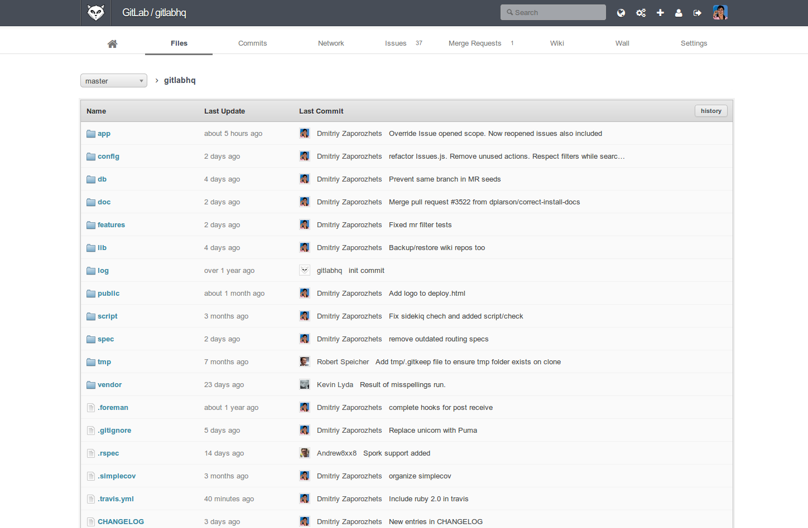

GitLab介紹
==========

目前最流行的線上Git專案管理系統可以說是非 `GitHub`_ 莫屬，對於一般OpenSource的專案選擇使用GitHub做為線上Git專案管理系統即可，也免收任何費用。但對於組織內部所開發的非OpenSource的專案而言，選擇使用GitHub不僅需要付費，保密性也有相當的顧慮。

若組織亦有上述的顧慮，可以選擇替代方案－`GitLab`_ ！

.. _GitHub: https://github.com/

.. _GitLab: http://gitlab.org/

=========================================
Self hosted Git management software
=========================================

事實上，若形容GitLab就是能夠hosting在組織內部網路的GitHub一點也不為過，因為其介面、功能都與GitHub十分神似，有使用GitHub經驗的開發者也能夠很快速上手。

	GitLab介面

而目前GitLab已整合了以下功能：

#. Repository access
#. Administration
#. Issues
#. Forks
#. Code review
#. Wiki
#. Merge Requests
#. Web Editor

如果有興趣的人也可以試試線上Demo版， `線上Demo連結`_ 。

.. _線上Demo連結: http://demo.gitlab.com/users/sign_in
