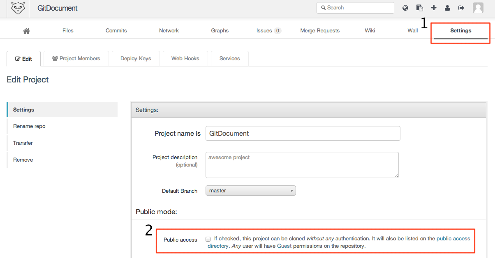

GitLab工作流程
==============

GitLab的工作流程其實與前述所提到的多人合作開發模式相差無幾。

以下是直接引述GitLab所提供之 GitLab Workflow ：

#. Clone project ::

	$ git clone git@example.com:project-name.git

#. Create branch with your feature ::

	$ git checkout -b $feature_name

#. Write code. Commit changes ::

	$ git commit -am "My feature is ready"

#. Push your branch to GitLab ::

	$ git push origin $feature_name

#. Review your code on Commits page
#. Create a merge request
#. Your team lead will review code & merge it to main branch

事實上，就這麼簡單。

以下主要補充使用GitLab需要注意的地方。

---------------------------
建立新專案
---------------------------

#. 介面操作1，新增專案

	.. figure:: images/GitLab/create_project1.png
		:width: 600px
		:align: center

#. 介面操作2，輸入專案名稱

	.. figure:: images/GitLab/create_project2.png
		:width: 600px
		:align: center

#. 介面操作3，新增完成(紅框部份需修改)

	.. figure:: images/GitLab/create_project3.png
		:width: 600px
		:align: center
	
完成上述3個步驟之後，其實只是在資料庫中建立專案的資料而已，並非在GitLab的檔案系統內建立一個新的專案資料夾，因此GitLab也分別針對全新專案及既有專案兩種情況，提供了一些指令說明如何建立專案資料夾。

* 建立新儲存庫 ::

	mkdir myfirstproject
	cd myfirstproject
	git init
	touch README
	git add README
	git commit -m 'first commit'
	git remote add origin git@10.2.0.15:your_account/myfirstproject.git
	git push -u origin master

* 匯入既有專案 ::

	cd existing_git_repo
	git remote add origin git@10.2.0.15:your_account/myfirstproject.git
	git push -u origin master

上述指令若GitLab安裝過程無誤，是可以良好運作的，如有任何問題，大多是網路環境(GitLab Server裝於VM內或使用NAT等原因)，這些情況就得更改上述指令才能運作。

----------------
匯入公鑰
----------------

#. 介面操作1

	.. figure:: images/GitLab/import_pubkey1.png
		:align: center
		:width: 600px

#. 介面操作2

	.. figure:: images/GitLab/import_pubkey2.png
                :align: center
                :width: 600px

----------------
開放專案
----------------

預設的專案是不開放的(private)，所以是無法被其他人(除了Team, Group成員之外)知道這個專案的存在。如果想開放專案給所有人看到，請參照以下操作。

