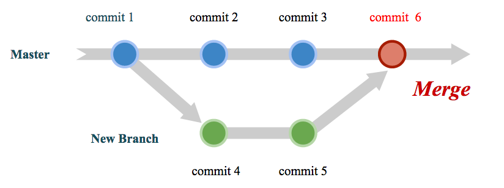
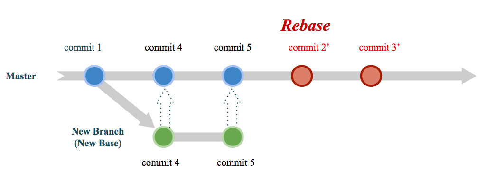
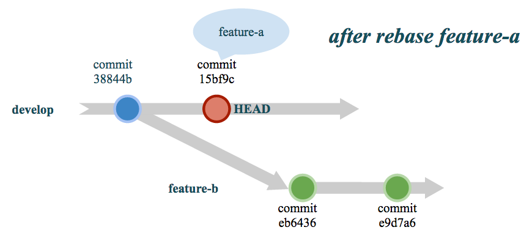
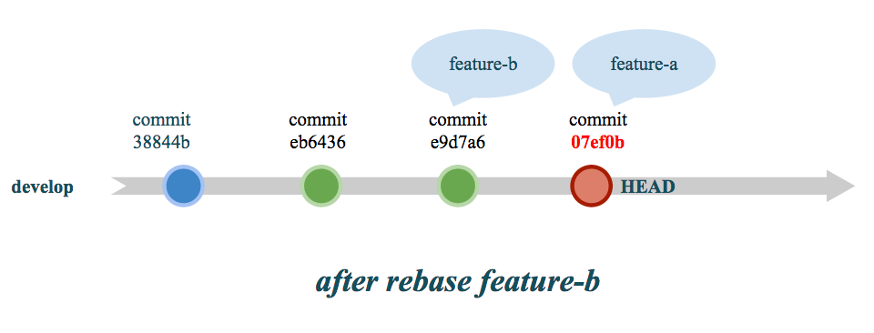
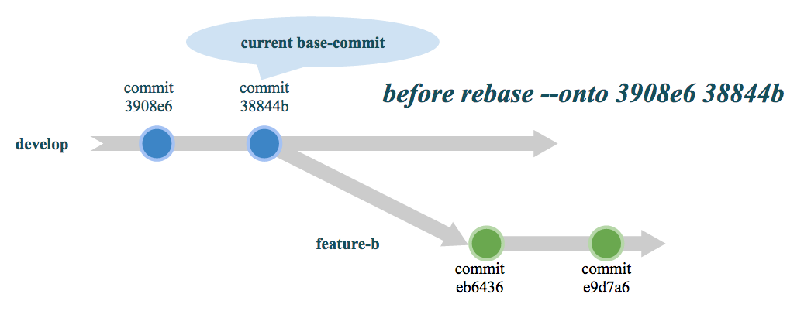
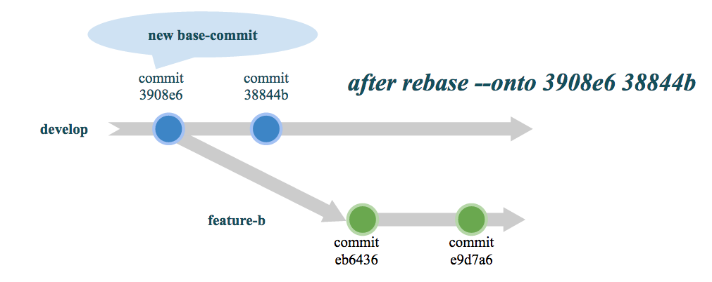

Rebase
======================

常言道「不會 `rebase` ，就等於沒學過 Git」，由此可見 `rebase`  在 Git 內有多重要。

在開始本文之前，請大家牢記「千萬不要對已經 `push` 到 **遠端儲存庫(remote repository)** 的提交進行 `rebase` 」，這是很危險的！詳情請見 `The Perils of Rebasing <http://git-scm.com/book/en/Git-Branching-Rebasing#The-Perils-of-Rebasing>`_

改變過去是很危險的！請牢記在心！

接下來，本文會說明什麼是 `rebase` ，並且介紹 `rebase`  的幾個基本用法。

======================
什麼是 rebase
======================

Rebase 對於很多人來說是一個很抽象的概念，也因此它的學習門檻就在於如何了解這個抽象的概念。對於 `rebase`  比較恰當的比喻應該是「移花接木」，簡單來講把你的分支接到別的分支上，稍後我們用幾個圖來示範 merge 與 `rebase`  的差異。

了解 `rebase` 之前，我們必須了解什麼是 `base` 。對 Git 的使用者而言，在分支中進行開發活動是稀鬆平常的事情，也因此在合併管理分支時，也就需要了解分支是在哪個時間點哪個提交點分出來的旁支，而長出旁支來的提交點，對於旁支來說就是 `base commit` ，也就是 `base` 。所以簡單來說， `rebase` 其實就是改變分支的 `base` 的功能。

下圖是在 merge 的情況會產生的版本演進的示意圖，可以看到在新的分支中所做的變更，在合併之後，一併成為一個新的提交(commit 6)。而 `commit 1` 就是 New Branch 的 `base` 。

    Merge 的示意

而下圖是 `rebase`  的情況下會產生的版本演進的示意圖。我們同樣是在分支中進行開發的動作，但是在 `rebase` 時，與 merge 不同的是，Git 會將分支上所做的變更先暫存起來，接著把 `newbase` (或稱新基準點)合併進來，最後直接將剛剛暫存起來的變更在分支上重演，這邊用「重演」這個字眼是表示「 **rebase 不是將提交(commit)複製到分支上，而是將整個變更過程一個一個重新套用到分支上** 」，也就因為如此 `commit 2'` 與 `commit 3'` ，才會有另外的 `'` 符號表示與原本的 `commit 2` , `commit 3` 不同，這點可以從 commit 的 SHA1 湊值不同看出來，雖然變更的內容相同，但是 commit 編號是不同的。本文會在稍後利用範例演示一遍。

    Rebase 的示意

也就因為如此，所以 `rebase` 的行為就很像「移花接木」，以上圖來說，就是把 New Branch 的變更整個接到 Master 上。

接下來的文章中，將會傳授 `rebase`  的 2 大主軸：

- 基礎用法
- 進階互動模式

在基礎用法中，我們將教授 `rebase` 分支剪接的部分。

而進階互動模式中將會說明如何交換提交次序、修改提交內容、合併提交內容，甚至將一個提交拆解成多個提交。

==========================
Rebase - 基礎用法
==========================

以下我們用一個情境示範 `rebase` 的「基礎用法」：

    你是一位 team leader，你的其中一項職務就是負責進行程式碼審查(code review)，並且將不同程式分支進行合併管理。

    現在有 2 位程式設計師以 `develop` 分支為基礎，分別開了新的分支 `feature-a` 與 `feature-b` ，也都已經完工了。
    你希望利用 `rebase` 的方式將這 2 個分支併入 `develop` 中。

首先， `develop` 的日誌如下所示：

::    

    commit 38844ba14312c642dcd0f72baf031de0c50ad736
    Author: one.man.army <one.man.army@example.com>
    Date:   Mon Sep 22 15:41:04 2014 +0800

        add HelloWorld.c

    commit 3908e6bc1007f12566fdb5a0fb43f4055560b880
    Author: one.man.army <one.man.army@example.com>
    Date:   Mon Sep 22 15:40:42 2014 +0800

        initial commit

接著， `feature-a` 的日誌如下所示:

::

    commit 15bf9c8954633700211f5b9d246ae67d8135cf29
    Author: one.man.army <one.man.army@example.com>
    Date:   Mon Sep 22 15:42:48 2014 +0800

        add feature_a.c

    commit 38844ba14312c642dcd0f72baf031de0c50ad736
    Author: one.man.army <one.man.army@example.com>
    Date:   Mon Sep 22 15:41:04 2014 +0800

        add HelloWorld.c

    commit 3908e6bc1007f12566fdb5a0fb43f4055560b880
    Author: one.man.army <one.man.army@example.com>
    Date:   Mon Sep 22 15:40:42 2014 +0800

        initial commit

最後是 `feature-b` 的日誌：

::

    commit e9d7a6f8b27bca86ef298911d84891b8a7efeada
    Author: one.man.army <one.man.army@example.com>
    Date:   Mon Sep 22 15:45:37 2014 +0800

        add #include <stdio.h>

    commit eb6436b59b7a0624f3ec5e5469ac36b37b5211e7
    Author: one.man.army <one.man.army@example.com>
    Date:   Mon Sep 22 15:43:55 2014 +0800

        add feature_b.c

    commit 38844ba14312c642dcd0f72baf031de0c50ad736
    Author: one.man.army <one.man.army@example.com>
    Date:   Mon Sep 22 15:41:04 2014 +0800

        add HelloWorld.c

    commit 3908e6bc1007f12566fdb5a0fb43f4055560b880
    Author: one.man.army <one.man.army@example.com>
    Date:   Mon Sep 22 15:40:42 2014 +0800

        initial commit

可以看到 `feature-a` 與 `feature-b` 分別比 `develop` 多出了 1, 2 個提交。

身為一名專業的 team leader，我們有著足夠的信心，相信這 2 個分支運作的很好，因此我們用以下指令進行 `rebase` 。

::

    $ git checkout develop
    $
    $ git rebase feature-a
    First, rewinding head to replay your work on top of it...
    Fast-forwarded develop to feature-a. 
    $
    $ git rebase feature-b
    First, rewinding head to replay your work on top of it...
    Applying: add feature_a.c

在上述指令中，我們先切換到 `develop` 分支中，接著我們很快的就利用指令 `git rebase <newbase>` 合併了 `feature-a` 與 `feature-b` 。此外，在上述的指令執行結果中，可以看到一行訊息顯示 `Fast-forwarded develop to feature-a` ，其中的 `Fast-forwarded` 是什麼意思呢？

    `Fast-forwarded` 指的就是當 2 個分支的頭尾相接時，代表 2 者之間不會有 conflict ，因此只要改 HEAD 的指向就能夠迅速合併了。以本情境為例， `develop` 的最後一個提交正好是 `feature-a` 的頭，所以這兩者的 `rebase` 適用 `Fast-forwarded` 模式。

接下來，可以用 `git log` 看看 `develop` 的日誌，我們可以從日誌中發現 `feature-a` 與 `feature-b` 的 `commit ID` 都不一樣了。

::

    $ git log
    commit 07ef0b8e0b1edd079fb8b69f6e6e215725b5aba4
    Author: spitfire-sidra <spitfire.sidra@gmail.com>
    Date:   Mon Sep 22 15:42:48 2014 +0800

        add feature_a.c

    commit e9d7a6f8b27bca86ef298911d84891b8a7efeada
    Author: spitfire-sidra <spitfire.sidra@gmail.com>
    Date:   Mon Sep 22 15:45:37 2014 +0800

        add #include <stdio.h>

    commit eb6436b59b7a0624f3ec5e5469ac36b37b5211e7
    Author: spitfire-sidra <spitfire.sidra@gmail.com>
    Date:   Mon Sep 22 15:43:55 2014 +0800

        add feature_b.c

    commit 38844ba14312c642dcd0f72baf031de0c50ad736
    Author: spitfire-sidra <spitfire.sidra@gmail.com>
    Date:   Mon Sep 22 15:41:04 2014 +0800

        add HelloWorld.c

    commit 3908e6bc1007f12566fdb5a0fb43f4055560b880
    Author: spitfire-sidra <spitfire.sidra@gmail.com>
    Date:   Mon Sep 22 15:40:42 2014 +0800

        initial commit

以上就是最簡單的 `rebase` 過程。

但是在這過程中，有些人可能產生了幾個疑問——「為什麼先 `rebase feature-a` 再 `rebase feature-b` 後，會是 `feature-a` 的日誌在最上方呢？」

這是由於 `rebase` 會先找出與 `newbase` 之間最近的一個共同 `base` ，然後先保留 HEAD 所在分支(也就是當前分支)從共同 `base` 開始的所有變更，接著從共同 `base` 開始，將 `newbase` 的變更重新套用到 HEAD 的所在分支後，再將方才所保留的當前分支變更一個一個套用進來，也因此 `feature-a` 會是最後的一個 `commit` 。

我們一樣以圖示進行說明。下圖 **After rebase feature-a** 是 `rebase feature-a` 之後的樣子，可以看到 `rebase feature-a` 之後 `develop` 與 `feature-b` 的共同 `base` 是 `commit 38844b` ，因此如果要再 `rebase feature-b` 的話， `commit 15bf9c` 會先被暫存起來，先進行 `rebase feature-b` 之後，再將剛剛暫存的 `commit 38844b` 重演一次，所以在圖 **After rebase feature-b** 中 `feature-a` 的 `commit ID` 就從 `338844b` 變成 `07ef0b` ，這就是 `rebase` 的過程了。

    After rebase feature-a

    After rebase feature-b

問題又來了，剛剛學的 `rebase` 會將整個分支都接上去，有時候我們不需要整個分支都接上去，只要接到分支上的某個提交的點即可，這種情況下可以使用 `rebase --onto` 進行。

假設只需要接到 `feature-b` 的 `commit eb6436` 時，就可以用以下指令進行 `rebase` ：

::

    $ git rebase feature-b --onto eb6436

又或者，想要把我們現在的分支整個接到某個分支點上面時，可以選擇另一種用法：

::

    $ git rebase --onto <new base-commit> <current base-commit>

例如，我們在 `feature-b` 分支上時，想把整個分支接到 `commit 3908e6` (initial commit) 時，可以輸入以下指令：

::

    $ git co feature-b #先切換到 feature-b
    $ git rebase --onto 3908e6 38844b

下面 2 張圖就是執行上述指令的前後對照。

    before rebase --onto 3908e6 38844b

    after rebase --onto 3908e6 38844b

==========================
Rebase - 進階互動模式
==========================

`Rebase` 的互動模式十分強大，可以允許我們交換提交的次序、修改提交內容、合併提交內容，甚至將一個提交拆解成多個提交。

要進入互動模式的基本指令如下， `base commit` 可以是分支上的任意一點：

::

    $ git rebase -i <base commit>

例如，我們想利用互動模式將 `feature-b` 上的提交做一些整理時，就可以用以下指令進入互動模式：

::

    $ git rebase -i 38844b

上述指令的意思就是我們希望將 `feature-b` 從 `commit 38844b` 之後的所有提交(不含 `commit 38844b` )進行整理。

接著就會出現類似以下的訊息：

::

    pick 1011f14 add feature_b.c
    pick d26076a add #include <stdio.h>

    # Rebase 38844ba..d26076a onto 38844ba
    #
    # Commands:
    #  p, pick = use commit
    #  r, reword = use commit, but edit the commit message
    #  e, edit = use commit, but stop for amending
    #  s, squash = use commit, but meld into previous commit
    #  f, fixup = like "squash", but discard this commit's log message
    #  x, exec = run command (the rest of the line) using shell
    #
    # These lines can be re-ordered; they are executed from top to bottom.
    #
    # If you remove a line here THAT COMMIT WILL BE LOST.
    #
    # However, if you remove everything, the rebase will be aborted.
    #
    # Note that empty commits are commented out 

在進一步操作前，我們必須對訊息上的幾個指令(commands)進行說明：

:pick:
    保留此提交

:reword:
    修改提交的訊息(只改提交訊息)

:edit:
    保留此提交，但是需要做一些修改(例如在程式裡面多加些註解)

:squash:
    保留此提交，但是將上面的提交一併併入此提交，此動作會顯示提交訊息供人編輯

:fixup:
    與squash相似，但是此提交的提交訊息會被上面的提交訊息取代

:exec:
    執行 shell 指令，例如 **exec make test** 進行一些測試，可以隨意穿插在提交點之間

---------------------
變換順序
---------------------

接下來，簡單示範變換提交的順序，此處我們想把提交的順序變成先 `commit 1011f14` 再來才是 `commit d26076a` ，我們只要簡單將上述的 `rebase` 訊息換成如下的訊息，也就是兩行互換即可，就能夠變換順序了！

::

    # 此處調換次序即可
    pick d26076a add #include <stdio.h>
    pick 1011f14 add feature_b.c

    # Rebase 38844ba..d26076a onto 38844ba
    #
    # Commands:
    #  p, pick = use commit
    #  r, reword = use commit, but edit the commit message
    #  e, edit = use commit, but stop for amending
    #  s, squash = use commit, but meld into previous commit
    #  f, fixup = like "squash", but discard this commit's log message
    #  x, exec = run command (the rest of the line) using shell
    #
    # These lines can be re-ordered; they are executed from top to bottom.
    #
    # If you remove a line here THAT COMMIT WILL BE LOST.
    #
    # However, if you remove everything, the rebase will be aborted.
    #
    # Note that empty commits are commented out

-------------------
修改提交內容
-------------------

有些時候，我們提交之後，不免會註解忘了加或是程式內還有測試的code忘記清掉。這時候除了用 `git reset --soft HEAD^` 之外，也可以用 `rebase` 編輯那些需要修正的提交。

例如，我們希望用 `rebase` 在 `commit 1011f14` 中添加幾個提交，就可以將 `pick` 改成 `edit` 進入編輯狀態。

::

    pick 1011f14 add feature_b.c
    edit d26076a add #include <stdio.h>

    # Rebase 38844ba..d26076a onto 38844ba
    #
    # Commands:
    #  p, pick = use commit
    #  r, reword = use commit, but edit the commit message
    #  e, edit = use commit, but stop for amending
    #  s, squash = use commit, but meld into previous commit
    #  f, fixup = like "squash", but discard this commit's log message
    #  x, exec = run command (the rest of the line) using shell
    #
    # These lines can be re-ordered; they are executed from top to bottom.
    #
    # If you remove a line here THAT COMMIT WILL BE LOST.
    #
    # However, if you remove everything, the rebase will be aborted.
    #
    # Note that empty commits are commented out

接下來，如果用 `git status` 就可以看到我們正在 `rebase` 的訊息：

::

    $ git status
    rebase in progress; onto 38844ba
    You are currently editing a commit while rebasing branch 'Feature-B' on '38844ba'.
      (use "git commit --amend" to amend the current commit)
      (use "git rebase --continue" once you are satisfied with your changes)

    nothing to commit, working directory clean

**如果你只是想修正提交訊息** ，就可以用以下指令 ：

::

    $ git commit --amend

**如果你需要多增加幾個提交，直接編輯吧** ，接著用 `git add <file>` , `git commit -m <message>` 等一般操作進行。最後再利用以下指令完成 `rebase` ：

::

    $ git rebase --continue

**又或者，我們現在編輯的提交實在是太大了，可能對程式碼審查的人造成困擾，例如同時修正太多個檔案，我們希望拆成比較明確的多個提交** ，就可以用以下指令回到未提交前的狀態：

::

    $ git reset HEAD^

然後就可以用 `git status` 列出這個提交中變更了多少檔案，然後依照需求一個一個用 `git add` 加進去後提交，多提交個幾次，就等於是將一個提交拆成多個提交囉！不過別忘了，要用以下指令結束 `rebase` 。

::

    $ git rebase --continue

以上就是 `rebase` 的幾個簡單說明與操作。

至於 `squash` , `fixup` 以及 `exec` 就留給各位去體驗了！

================================
Rebase 出現問題時的處理方法
================================

`Rebase` 與 `merge` 一樣都可能會產生 **conflict** ，這時候除了修正 **conflict** 之後再用 `git add <file>` , `git rebase --continue` 完成 `rebase` 之外，也可以用 `git rebase --abort` 直接放棄 `rebase` 。

::

    git rebase (--continue | --abort | --skip)

此外，對於 `rebase` 使用不慎時，我們會希望能夠直接回復到 `rebase` 之前的狀態，以下就是幾個指令可以用來回復到 `rebase` 之前的狀態。 參考自 StackOverFlow_ 。

回復方法 1 ：

::

    # 最簡單的用法
    $ git reset --hard ORIG_HEAD

回復方法 2 ：

::

    # rebase 之前先上 tag   
    $ git tag BACKUP
    $ ... # rebase 過程
    $ ... # rebase 過程
    $ git reset --hard BACKUP # 失敗的話可以直接回復到 tag BACKUP

回復方法 3 ：

::

    $ git reflog # 尋找要回復的 HEAD ，以下假設是 HEAD@{3}
    $ git reset --hard HEAD@{3} # 回復

.. _StackOverFlow: http://stackoverflow.com/questions/134882/undoing-a-git-rebase
